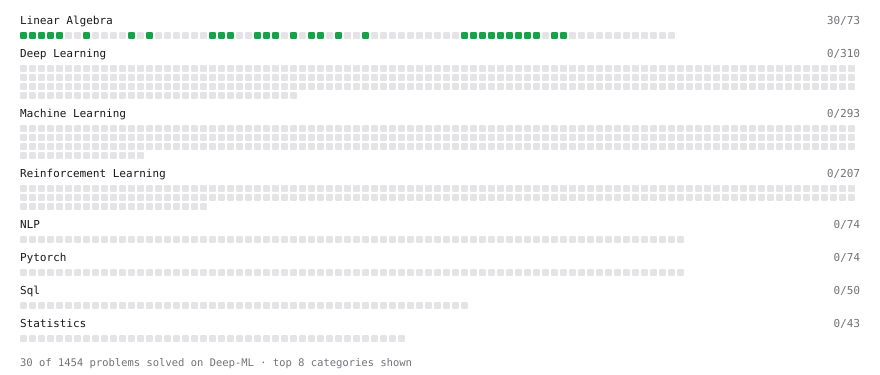

# Deep-ML

My machine learning practice from [Deep-ML](https://www.deep-ml.com). Every solution here was written by hand.

**40** solved · 40 problems · 0 labs · 0 math

[**Browse the interactive portfolio**](https://henry-a-m-webster.github.io/deep-ml/) to replay this filling in over time.

## Problems

| | Difficulty | Solved | |
| --- | --- | --- | --- |
| [Calculate 2x2 Matrix Inverse](https://www.deep-ml.com/problems/8) | easy | 2026-09-25 | [solution](problems/0008-calculate-2x2-matrix-inverse) |
| [Calculate Cosine Similarity Between Vectors](https://www.deep-ml.com/problems/76) | easy | 2026-09-27 | [solution](problems/0076-calculate-cosine-similarity-between-vectors) |
| [Calculate Mean by Row or Column](https://www.deep-ml.com/problems/4) | easy | 2026-09-24 | [solution](problems/0004-calculate-mean-by-row-or-column) |
| [Check Linear Independence of Vectors](https://www.deep-ml.com/problems/331) | easy | 2026-09-27 | [solution](problems/0331-check-linear-independence-of-vectors) |
| [Compute the Cross Product of Two 3D Vectors](https://www.deep-ml.com/problems/118) | easy | 2026-09-27 | [solution](problems/0118-compute-the-cross-product-of-two-3d-vectors) |
| [Convert Vector to Diagonal Matrix](https://www.deep-ml.com/problems/35) | easy | 2026-09-25 | [solution](problems/0035-convert-vector-to-diagonal-matrix) |
| [Dot Product Calculator](https://www.deep-ml.com/problems/83) | easy | 2026-09-27 | [solution](problems/0083-dot-product-calculator) |
| [Implement Compressed Column Sparse Matrix Format (CSC)](https://www.deep-ml.com/problems/67) | easy | 2026-09-25 | [solution](problems/0067-implement-compressed-column-sparse-matrix-format-csc) |
| [Implement Compressed Row Sparse Matrix (CSR) Format Conversion](https://www.deep-ml.com/problems/65) | easy | 2026-09-25 | [solution](problems/0065-implement-compressed-row-sparse-matrix-csr-format-conversion) |
| [Implement Orthogonal Projection of a Vector onto a Line](https://www.deep-ml.com/problems/66) | easy | 2026-09-25 | [solution](problems/0066-implement-orthogonal-projection-of-a-vector-onto-a-line) |
| [L2 Normalization Along an Axis](https://www.deep-ml.com/problems/1022) | easy | 2026-09-28 | [solution](problems/1022-l2-normalization-along-an-axis) |
| [Matrix Determinant & Trace](https://www.deep-ml.com/problems/195) | easy | 2026-09-27 | [solution](problems/0195-matrix-determinant-trace) |
| [Matrix-Vector Dot Product](https://www.deep-ml.com/problems/1) | easy | 2026-09-24 | [solution](problems/0001-matrix-vector-dot-product) |
| [Phi Transformation for Polynomial Features](https://www.deep-ml.com/problems/84) | easy | 2026-09-27 | [solution](problems/0084-phi-transformation-for-polynomial-features) |
| [Random Rotation Matrix and a Rotation Layer](https://www.deep-ml.com/problems/1190) | easy | 2026-09-28 | [solution](problems/1190-random-rotation-matrix-and-a-rotation-layer) |
| [Reshape Matrix](https://www.deep-ml.com/problems/3) | easy | 2026-09-24 | [solution](problems/0003-reshape-matrix) |
| [Row-Normalize a Count Matrix to Probabilities](https://www.deep-ml.com/problems/985) | easy | 2026-09-27 | [solution](problems/0985-row-normalize-a-count-matrix-to-probabilities) |
| [Scalar Multiplication of a Matrix](https://www.deep-ml.com/problems/5) | easy | 2026-09-24 | [solution](problems/0005-scalar-multiplication-of-a-matrix) |
| [Tensor Puzzle: Circular Roll by One](https://www.deep-ml.com/problems/1277) | easy | 2026-09-28 | [solution](problems/1277-tensor-puzzle-circular-roll-by-one) |
| [Tensor Puzzle: Extract the Diagonal](https://www.deep-ml.com/problems/1271) | easy | 2026-09-28 | [solution](problems/1271-tensor-puzzle-extract-the-diagonal) |
| [Tensor Puzzle: First-Order Difference](https://www.deep-ml.com/problems/1275) | easy | 2026-09-28 | [solution](problems/1275-tensor-puzzle-first-order-difference) |
| [Tensor Puzzle: Heaviside Step with Zero-Value](https://www.deep-ml.com/problems/1286) | easy | 2026-09-28 | [solution](problems/1286-tensor-puzzle-heaviside-step-with-zero-value) |
| [Tensor Puzzle: Identity Matrix from Comparisons](https://www.deep-ml.com/problems/1272) | easy | 2026-09-28 | [solution](problems/1272-tensor-puzzle-identity-matrix-from-comparisons) |
| [Tensor Puzzle: Linspace from Endpoints](https://www.deep-ml.com/problems/1285) | easy | 2026-09-28 | [solution](problems/1285-tensor-puzzle-linspace-from-endpoints) |
| [Tensor Puzzle: Ones Vector from First Principles](https://www.deep-ml.com/problems/1268) | easy | 2026-09-28 | [solution](problems/1268-tensor-puzzle-ones-vector-from-first-principles) |
| [Tensor Puzzle: Outer Product via Broadcasting](https://www.deep-ml.com/problems/1270) | easy | 2026-09-28 | [solution](problems/1270-tensor-puzzle-outer-product-via-broadcasting) |
| [Tensor Puzzle: Pad or Truncate a Vector to Length j](https://www.deep-ml.com/problems/1280) | easy | 2026-09-28 | [solution](problems/1280-tensor-puzzle-pad-or-truncate-a-vector-to-length-j) |
| [Tensor Puzzle: Repeat a Vector as Rows](https://www.deep-ml.com/problems/1287) | easy | 2026-09-28 | [solution](problems/1287-tensor-puzzle-repeat-a-vector-as-rows) |
| [Tensor Puzzle: Reverse a Vector](https://www.deep-ml.com/problems/1278) | easy | 2026-09-28 | [solution](problems/1278-tensor-puzzle-reverse-a-vector) |
| [Tensor Puzzle: Stack Two Vectors as Rows](https://www.deep-ml.com/problems/1276) | easy | 2026-09-28 | [solution](problems/1276-tensor-puzzle-stack-two-vectors-as-rows) |
| [Tensor Puzzle: Sum a Vector with a Dot Product](https://www.deep-ml.com/problems/1269) | easy | 2026-09-28 | [solution](problems/1269-tensor-puzzle-sum-a-vector-with-a-dot-product) |
| [Tensor Puzzle: Upper-Triangular Ones Matrix](https://www.deep-ml.com/problems/1273) | easy | 2026-09-28 | [solution](problems/1273-tensor-puzzle-upper-triangular-ones-matrix) |
| [Transformation Matrix from Basis B to C](https://www.deep-ml.com/problems/27) | easy | 2026-09-25 | [solution](problems/0027-transformation-matrix-from-basis-b-to-c) |
| [Transpose of a Matrix](https://www.deep-ml.com/problems/2) | easy | 2026-09-24 | [solution](problems/0002-transpose-of-a-matrix) |
| [Vector Element-wise Sum](https://www.deep-ml.com/problems/121) | easy | 2026-09-27 | [solution](problems/0121-vector-element-wise-sum) |
| [Vector Norms (L1/L2/L-inf) and the Frobenius Norm](https://www.deep-ml.com/problems/328) | easy | 2026-09-27 | [solution](problems/0328-vector-norms-l1-l2-l-inf-and-the-frobenius-norm) |
| [Calculate Eigenvalues of a Matrix](https://www.deep-ml.com/problems/6) | medium | 2026-09-29 | [solution](problems/0006-calculate-eigenvalues-of-a-matrix) |
| [Matrix times Matrix ](https://www.deep-ml.com/problems/9) | medium | 2026-09-29 | [solution](problems/0009-matrix-times-matrix) |
| [Matrix Transformation ](https://www.deep-ml.com/problems/7) | medium | 2026-09-29 | [solution](problems/0007-matrix-transformation) |
| [Solve Linear Equations using Jacobi Method](https://www.deep-ml.com/problems/11) | medium | 2026-09-29 | [solution](problems/0011-solve-linear-equations-using-jacobi-method) |

---

_This file is regenerated by Deep-ML on every push._
